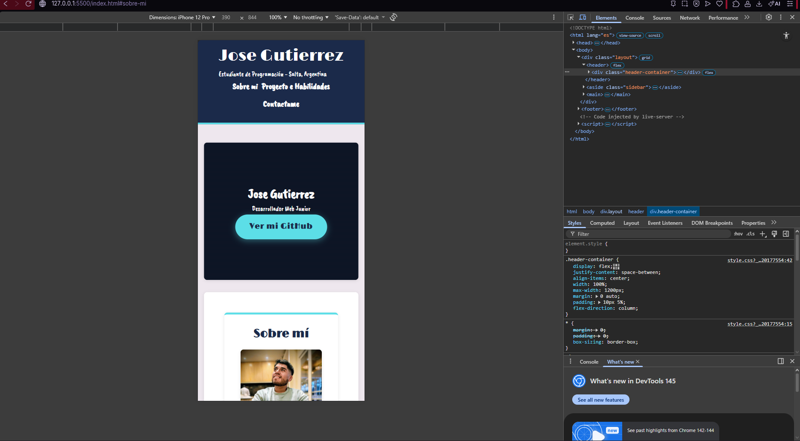
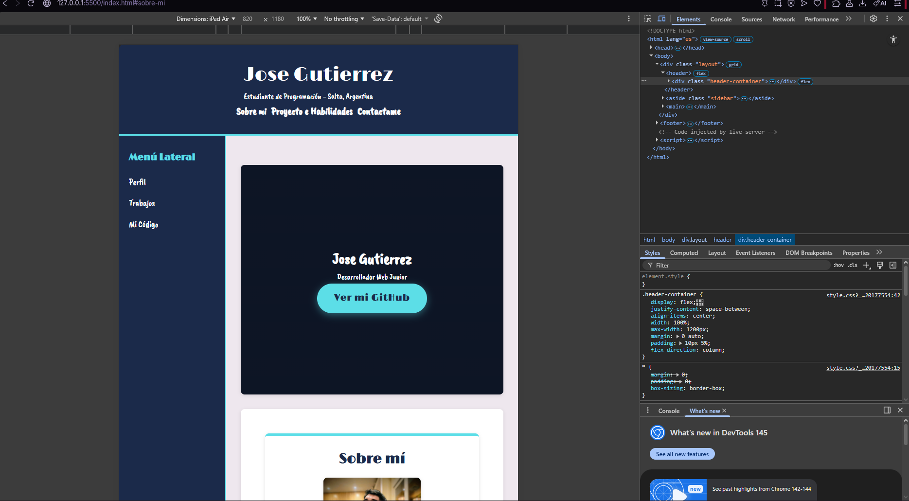
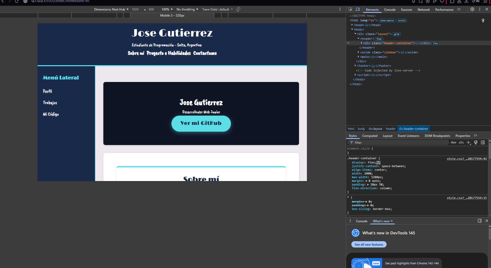

# Mi Primera Página - Portfolio Personal

### Descripción
Este es mi primer proyecto integral desarrollado para la materia Prácticas Profesionalizantes II. Es un portfolio personal que muestra mis habilidades como Desarrollador Web Junior y mis proyectos actuales.

## 🚀 Sitio en Vivo
[Ver mi sitio aqui](https://github.com/Gutierrez-Jose-M)

## 🛠️ Tecnologías Utilizadas
* **HTML5** (Estructura semántica)
* **CSS3** (Estilos avanzados y variables)
* **Flexbox** (Alineación de componentes y tarjetas)
* **CSS Grid** (Layout principal con Grid Areas)
* **Responsive Design** (Estrategia Mobile-First con Media Queries)

## Capturas de Pantalla
Aquí se puede observar cómo el diseño se adapta a diferentes dispositivos:

## Capturas de Pantalla del Proyecto

### 1. Vista Mobile (iPhone 12 - 393px)

---

### 2. Vista Tablet (iPad Air - 820px)

---

### 3. Vista Desktop (Nest Hub Max - 1024px)
